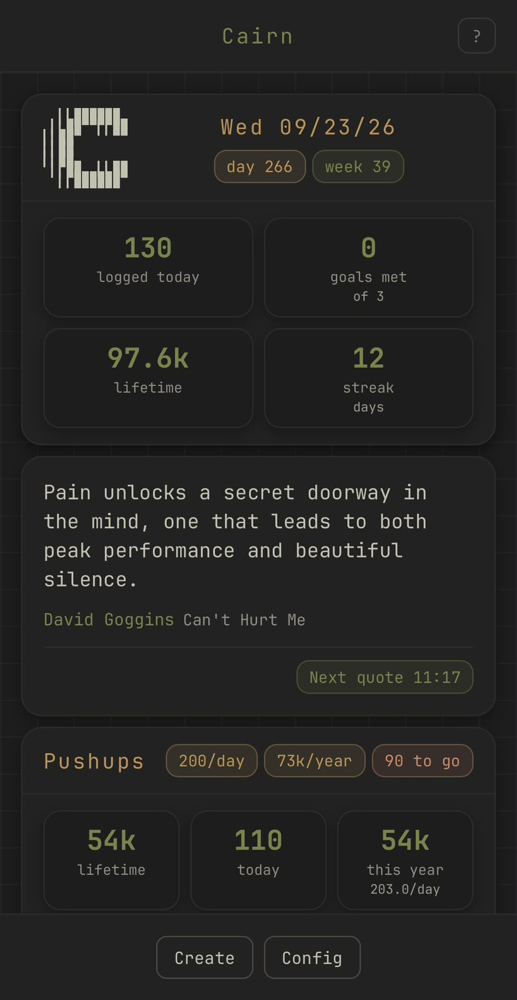
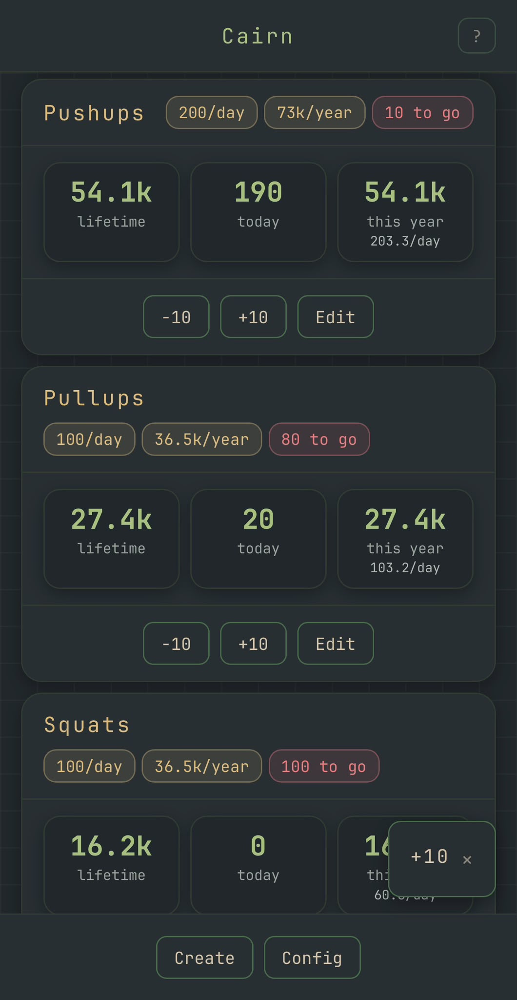
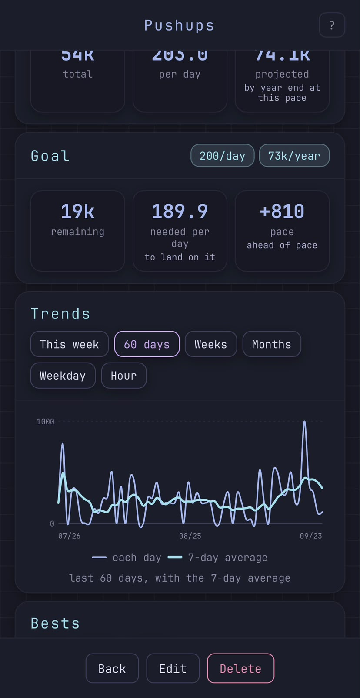
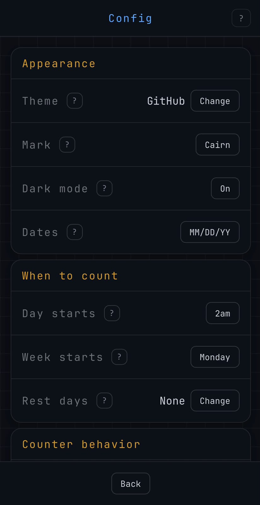

# Cairn

A counter, named for the pile of stones where everyone who passes adds one. You
name something you do, log how many you did today, and the number goes up and
stays up.

I built it to track lifetime pull-ups and push-ups. A lifetime total on its own
is a trivia fact, so Cairn also breaks it down by year: this year's total, the
average per day, what day of the year it is, and if you set a goal, whether
you're ahead or behind and what today needs to be to catch up.

Everything lives on the device in SQLite. No account, no server, nothing leaves
the phone. Export is a CSV of two columns, `day` and `count`, because that's
all the raw data actually is.

Desktop and iOS today. An Apple Watch version is the reason the counting logic
is kept free of any UI or database code.

| | |
|:---:|:---:|
|  |  |
| Today across every counter, then a quote | Each counter and what today still owes |
|  |  |
| Pace against a goal, and 60 days of history | Every setting explains itself |

## Running it

```
cargo install dioxus-cli --locked
dx serve                      # desktop
dx serve --platform ios       # simulator, boot one first with simctl
cargo test
dx check                      # hook order, the one clippy can't see
```

## A note on how it's built

This is a personal app, and it leans hard on AI code generation. More than I'd
use on something other people depend on.

What that doesn't change: it follows the same architecture and the same bar as
my other repos. The domain stays pure, storage stays behind a port, SQL lives
in one file, clippy runs pedantic with panics denied, and CI has to pass. AI
writing most of the lines is a speed decision, not permission to let the
structure rot.

Rules and layout are in `context/`, starting at `context/README.md`.
